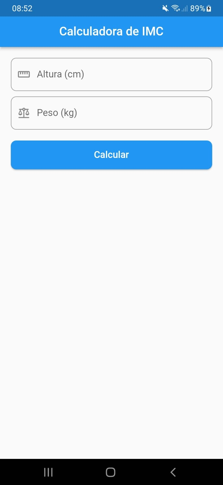
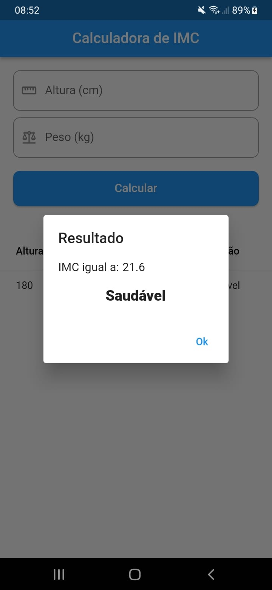
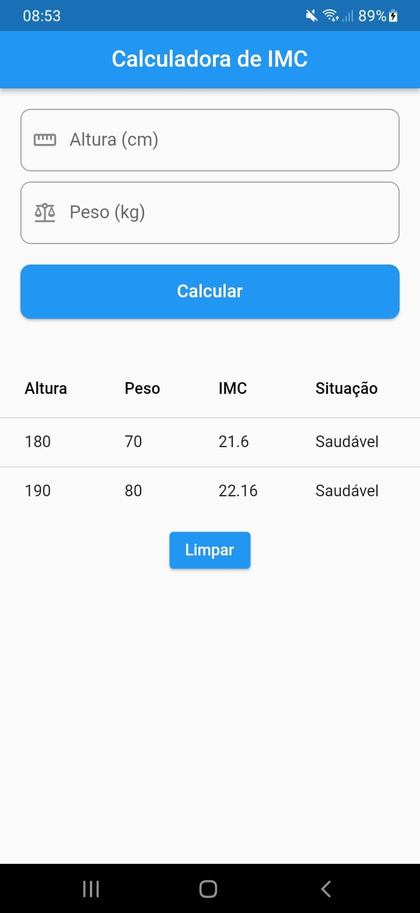

# Calculadora de IMC

  
  

## Projeto

### O que irá encontrar:

<ul>
  <li>
    Tela principal do aplicativo com o formulário para inserir os dados do cálculo.
  </li>
  <li>
    Pop-up que mostra o resultado do IMC com a sua interpretação após o cálculo.
  </li>
  <li>
    Tela principal com os resultados dos cálculos de IMC após realizar o primerio cálculo.
  </li>

## Screenshots

<h3>Tela principal</h3>

<h3>Popup com o resultado do IMC</h3>

<h3>Tela inicial com os resultados dos cálculos feitos</h3>

## 🛠 Tecnologias

As seguintes ferramentas foram usadas na construção desse projeto:

- [Dart](https://dart.dev/)
- [Flutter](https://flutter.dev/)
- [Git](https://git-scm.com/)

 

## Autor

  <b>Dário Matias</b>

 
  Entre em contato!
 
 

